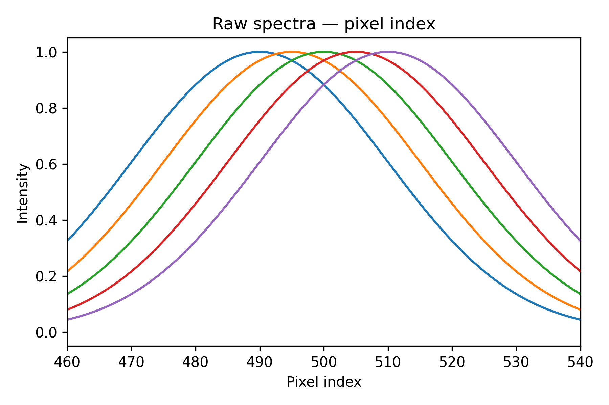
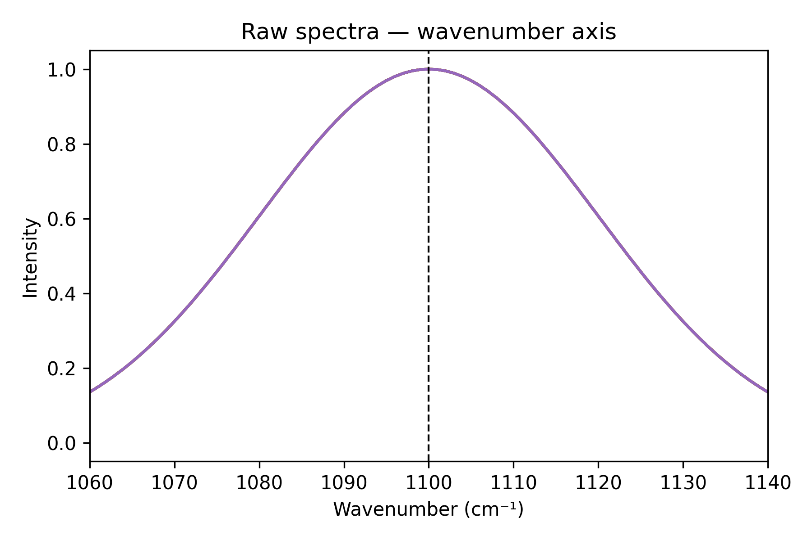
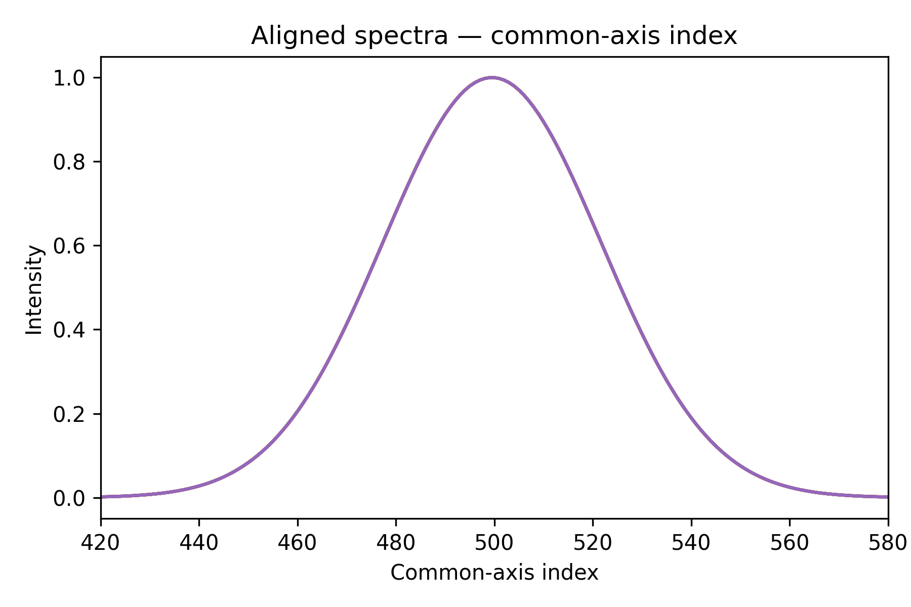

.. _dynamic_transformers:

Dynamic transformers
====================

In conventional chemometrics practice, preprocessing is treated as a
**static** operation: a correction is determined from a calibration set and
then applied uniformly to every new spectrum. The preprocessing step holds
everything it needs — a stored mean spectrum, a fitted baseline, a set of
PLS loadings — and the data alone is sufficient at prediction time.

This works well for a large class of problems, but it breaks down when the
correction you need to apply depends on **information that is only available
at inference time**. In practice this information falls into two categories:

* **Measurement metadata** — instrument-level quantities recorded alongside
  the spectrum but not part of it: the x-axis calibration, laser power,
  integration time, detector temperature.
* **Process data** — sample- or batch-level context that changes between
  runs or samples: a fresh background measurement, a dilution factor, a reference
  standard collected just before the sample or other process parameters such as 
  temperature or humidity.

Some concrete examples from spectroscopy:

* The **x-axis grid** of the instrument drifted between calibration and
  deployment. Each new spectrum arrives on a slightly different wavenumber
  array.
* You want to **normalize by laser power** or integration time, values that
  are logged per measurement but are not part of the spectrum itself.
* A **background spectrum** is measured fresh before each sample batch and
  must be subtracted at inference, not at fit time.

``chemotools`` addresses this with a set of *dynamic transformers* — estimators
that accept additional **per-call parameters** alongside ``X`` at transform
time, delivered through `scikit-learn's metadata routing framework
<https://scikit-learn.org/stable/metadata_routing.html>`_.

.. list-table:: Dynamic transformers in ``chemotools``
   :widths: 35 30 35
   :header-rows: 1

   * - Transformer
     - Metadata argument
     - Use case
   * - :class:`~chemotools.adaptation.XAxisInterpolator`
     - ``x_axis``
     - Align spectra measured on different wavenumber grids
   * - ``ScaleBy`` *(coming soon)*
     - ``scale``
     - Normalize by laser power, integration time, temperature factor
   * - ``SubtractBackground`` *(coming soon)*
     - ``reference``
     - Subtract a freshly measured background at inference

Example: aligning spectra to a common grid
-------------------------------------------

In Raman spectroscopy, each instrument has a slightly different
pixel-to-wavenumber calibration. Spectra from different instruments share the
same chemistry but arrive on different x-axis grids — so they cannot be
stacked into a matrix until they are resampled onto a common one.

Five simulated spectra, each with a Gaussian peak at 1100 cm⁻¹ but on a
slightly different grid, illustrate the problem.

**Setting up the data**

.. code-block:: python

    import numpy as np
    import sklearn
    import matplotlib.pyplot as plt
    from chemotools.adaptation import XAxisInterpolator

    sklearn.set_config(enable_metadata_routing=True)  # explained in "How metadata routing works" below

    N       = 1000                   # pixels per spectrum
    sigma   = 20                     # peak width (pixels)
    offsets = [-10, -5, 0, 5, 10]   # pixel-grid offset per instrument

    raw_spectra, raw_x_axes = [], []

    for offset in offsets:
        peak = N // 2 + offset
        y = np.exp(-0.5 * ((np.arange(N) - peak) / sigma) ** 2)
        x = np.arange(N) + (1100 - peak)      # x[peak] == 1100 wn
        raw_spectra.append(y)
        raw_x_axes.append(x)

    raw_spectra = np.array(raw_spectra)   # shape (5, 1000)
    raw_x_axes  = np.array(raw_x_axes)    # shape (5, 1000)

**Step 1 — what the instrument gives you**

Each spectrum is delivered as an array of intensity values indexed by pixel
number. When you plot them on a common pixel axis, the peaks appear at
different positions — each instrument's zero point is slightly different.

.. code-block:: python

    zoom = 40

    fig, ax = plt.subplots(figsize=(6, 4))
    for y in raw_spectra:
        ax.plot(y)
    ax.set_xlim(N // 2 - zoom, N // 2 + zoom)
    ax.set(title="Raw spectra — pixel index", xlabel="Pixel index", ylabel="Intensity")
    plt.tight_layout()
    plt.show()

|

Peaks land at different pixel positions — the grids are misaligned. If you
stacked these rows into a matrix as-is and fed it to a PLS model, column *k*
would represent a different wavenumber for each instrument, so every learned
regression coefficient would point at the wrong feature.

**Step 2 — plot against wavenumber**

Each spectrum comes with its own wavenumber axis. Plotting against it shows
the peaks coincide at 1100 cm⁻¹, but the arrays are still all different.

.. code-block:: python

    fig, ax = plt.subplots(figsize=(6, 4))
    for y, x in zip(raw_spectra, raw_x_axes):
        ax.plot(x, y)
    ax.axvline(1100, color="k", linestyle="--", linewidth=1)
    ax.set_xlim(1100 - zoom, 1100 + zoom)
    ax.set(title="Raw spectra — wavenumber axis", xlabel="Wavenumber (cm⁻¹)", ylabel="Intensity")
    plt.tight_layout()
    plt.show()

|

**Step 3 — interpolate onto a common grid**

:class:`~chemotools.adaptation.XAxisInterpolator` takes a ``common_x_axis``
defined once at construction time and, at every ``transform`` call, resamples
each row from its own ``x_axis`` onto that shared grid. The per-spectrum
axis is passed as metadata — not baked into the transformer — so it can
change freely between calls.

.. code-block:: python

    x_common = np.linspace(650, 1550, N)

    interpolator = (
        XAxisInterpolator(
            common_x_axis=x_common, method="linear", left=0, right=0
        )  # left/right fill values outside the grid
        .set_fit_request(x_axis=True)
        .set_transform_request(x_axis=True)
    )

    aligned_spectra = interpolator.fit_transform(raw_spectra, x_axis=raw_x_axes)

.. code-block:: python

    fig, ax = plt.subplots(figsize=(6, 4))
    for y in aligned_spectra:
        ax.plot(y)
    ax.set(
        title="Aligned spectra — common-axis index",
        xlabel="Common-axis index",
        ylabel="Intensity",
    )
    plt.tight_layout()
    ax.set_xlim(420, 580)
    plt.show()

|

All five peaks now sit at the same column index. The matrix ``aligned_spectra``
can be fed directly into any subsequent step or model.

How metadata routing works
---------------------------

The two method calls on the interpolator — ``set_fit_request(x_axis=True)``
and ``set_transform_request(x_axis=True)`` — register ``x_axis`` as a
metadata argument for the ``fit`` and ``transform`` phases respectively.
When you pass ``x_axis`` to a pipeline call, scikit-learn delivers it only
to the step that declared it; every other step is unaffected.

``set_fit_request`` covers ``fit`` and ``fit_transform``;
``set_transform_request`` covers ``transform``. Both are declared in the
example because a :class:`~sklearn.pipeline.Pipeline` calling
``fit_transform`` routes metadata through both phases.

Using it inside a Pipeline
---------------------------

The pipeline below continues from the same variables defined above:

.. code-block:: python

    from sklearn.pipeline import Pipeline
    from sklearn.preprocessing import StandardScaler
    from chemotools.scatter import MultiplicativeScatterCorrection

    pipe = Pipeline(
        [
            (
                "interpolate",
                XAxisInterpolator(
                    common_x_axis=x_common, method="linear", left=0, right=0
                )  # left/right fill values outside the grid
                .set_fit_request(x_axis=True)
                .set_transform_request(x_axis=True),
            ),
            ("msc", MultiplicativeScatterCorrection()),
            ("scaler", StandardScaler()),
        ]
    )

    # x_axis is routed to "interpolate" only; the other steps never see it
    X_preprocessed = pipe.fit_transform(raw_spectra, x_axis=raw_x_axes)

.. note::

   Only the step that declared ``set_transform_request(x_axis=True)`` receives
   ``x_axis``. The other steps in the pipeline are unaffected.

Shared vs. per-sample grids
-----------------------------

Not every batch comes from multiple instruments. When all spectra in a call
share the same grid, you can pass a single 1-D array instead of a matrix.
``x_axis`` accepts two shapes:

* **Shape** ``(n_features,)`` — the same grid for every spectrum in the
  call. Use this when all spectra in a batch come from the same instrument
  (e.g., a single measurement session where the grid is fixed).

* **Shape** ``(n_samples, n_features)`` — one grid per row. Use this when
  combining spectra from multiple instruments in one batch (as in the
  example above, where each of the five spectra has its own offset).

.. code-block:: python

    # Shared grid — all spectra measured on the same instrument axis
    x_shared = raw_x_axes[0]                          # shape (1000,)
    X_aligned_shared = interpolator.transform(raw_spectra, x_axis=x_shared)

    # Per-sample grids — each spectrum has its own axis
    X_aligned_per = interpolator.transform(raw_spectra, x_axis=raw_x_axes)  # shape (5, 1000)

Interpolation methods
----------------------

:class:`~chemotools.adaptation.XAxisInterpolator` supports three methods,
selectable via the ``method`` parameter:

.. list-table::
   :widths: 15 55 30
   :header-rows: 1

   * - ``method``
     - Description
     - When to use
   * - ``"linear"``
     - Piecewise linear interpolation.
     - Fast; best when spectra are smooth and grids are closely spaced.
   * - ``"cubic"``
     - Natural cubic spline (via :func:`scipy.interpolate.CubicSpline`).
     - Good all-round choice; smooth and accurate.
   * - ``"pchip"``
     - Piecewise cubic Hermite (via :func:`scipy.interpolate.PchipInterpolator`).
     - Preserves monotonicity; avoids overshooting near peaks.

Points outside the input grid are filled with ``left`` / ``right`` (both
default to :data:`numpy.nan`). You can change these to ``0.0`` or any other
sentinel value if your downstream steps cannot handle ``NaN``.

That is the core idea behind dynamic transformers: pipelines that stay
self-contained and reusable even when correction parameters are not known
until prediction time.

.. seealso::

   :doc:`XAxisInterpolator <../methods/generated/chemotools.adaptation.XAxisInterpolator>` — full API reference.

