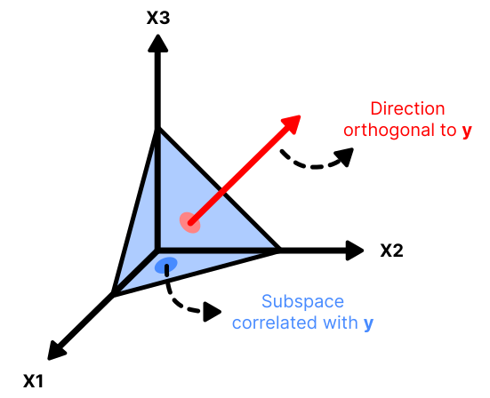
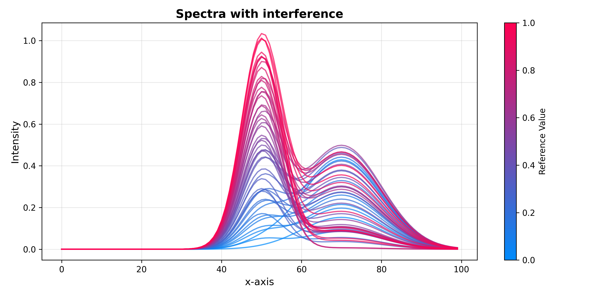
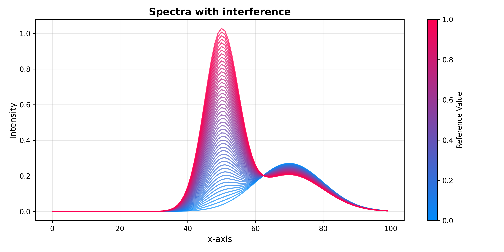
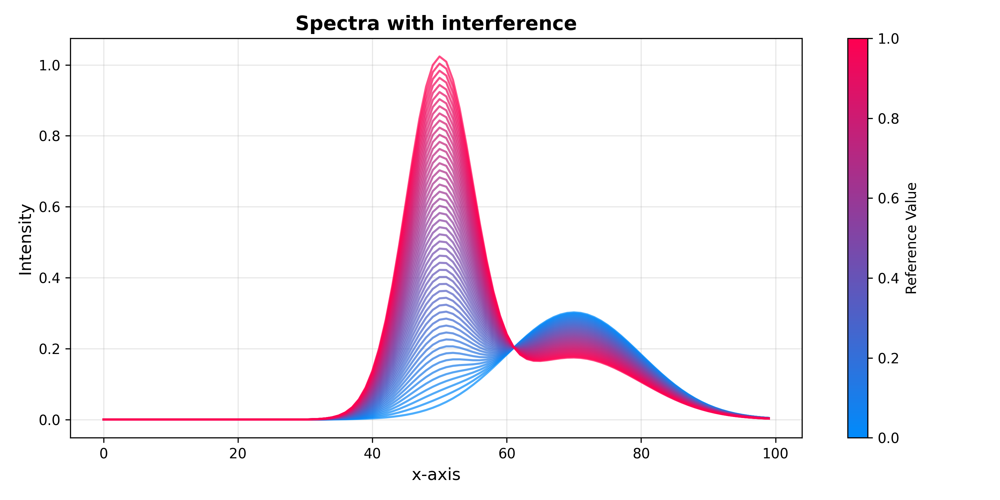

.. _orthogonal_projections:

Orthogonal projections
======================

Spectroscopic measurements almost always contain variation that is irrelevant
to the property you want to predict — baseline drift, temperature effects,
scattering differences, instrument noise. **Orthogonal projection** methods
identify this unwanted systematic variation and remove it before calibration,
leaving a simpler, more interpretable dataset for the downstream model.

``chemotools`` provides three supervised orthogonal filtering methods in
:mod:`chemotools.projection`:

* :class:`~chemotools.projection.OrthogonalSignalCorrection` (OSC)
* :class:`~chemotools.projection.OrthogonalPLS` (OPLS)
* :class:`~chemotools.projection.DirectOrthogonalization` (DO)

All three are sklearn-compatible transformers: they accept ``(X, y)`` in
``fit`` and return a corrected ``X`` with the same number of features from
``transform``. Their behaviour has been systematically compared by
Svensson, Kourti & MacGregor [1]_.

.. _epo:

.. note::

   A fourth method — :class:`~chemotools.projection.ExternalParameterOrthogonalization`
   (EPO) — handles *unsupervised* removal of variation linked to known external
   factors (e.g., temperature, humidity). It is covered on its own page.

.. important::

   Svensson et al. [1]_ found that **none of these methods consistently improve
   prediction accuracy** over plain PLS on raw data. Their primary benefit is
   **model simplicity and interpretability**: the corrected data requires fewer
   PLS components, and the removed variation can itself carry useful diagnostic
   information about the measurement process.

What does "orthogonal" mean here?
----------------------------------

After fitting a model on spectra ``X`` to predict ``y``, the total variance in
``X`` can be decomposed into:

* **Predictive variation** — correlated with ``y``, informative for the model.
* **Orthogonal variation** — uncorrelated with ``y``, systematic noise or
  interference for the regression task.

Removing orthogonal variation before building the model reduces the number of
PLS components needed and often makes the resulting loadings easier to
interpret chemically.

*Figure adapted from:* Di Carlo, S. & Falasconi, M. "Drift Correction Methods for
Gas Chemical Sensors in Artificial Olfaction Systems: Techniques and Challenges."
Politecnico di Torino, Torino; SENSOR CNR-IDASC / University of Brescia, Brescia, Italy.

|

Choosing a method
------------------

Svensson et al. [1]_ identified two groups of algorithms based on how they
interact with the downstream PLS model:

* **Group 1 — efficient reduction (OSC variants)**: removing a single
  orthogonal component is often sufficient to substantially reduce the number
  of PLS components needed. One component does the work of several.
* **Group 2 — one-for-one reduction (OPLS, DO)**: each orthogonal component
  removed reduces the complexity of the calibration model by exactly one PLS
  component.

.. list-table::
   :widths: 20 15 20 45
   :header-rows: 1

   * - Method
     - Group [1]_
     - Iterative
     - Notes
   * - OSC (wold)
     - 1
     - Yes
     - Original formulation; can behave differently under non-linearities.
   * - OSC (sjoblom)
     - 1
     - Yes
     - Modified iteration; often converges faster than ``"wold"``.
   * - OSC (fearn)
     - 1
     - No
     - Direct, non-iterative; deterministic and fast.
   * - OPLS
     - 2
     - Yes (deflation)
     - Explicitly separates predictive and orthogonal variation.
   * - DO
     - 2
     - No
     - Projects X onto the null space of y, then extracts components via PCA.

A practical rule of thumb:

* Use **OSC (fearn)** as the default — it is non-iterative, deterministic,
  and one component is often sufficient.
* Use **OPLS** when you want an explicit separation of predictive and
  orthogonal scores for further analysis.
* Use **DO** as a simple, fast baseline to compare against.

.. warning::

   Extracting too many orthogonal components risks **stripping predictive
   variation** alongside the noise. Start with ``n_components=1`` and increase
   only if cross-validation confirms improved model simplicity without loss of
   prediction accuracy.

Simulated dataset
------------------

The examples below use a simple synthetic dataset where the analyte signal and
the interference are known by construction — making it easy to verify visually
that each method removes the right variation.

The dataset consists of 50 spectra. Each spectrum is a mixture of an analyte
peak at channel 50 and an interference peak at channel 70. The analyte
amplitude scales linearly with the concentration ``y``, while the interference
amplitude is drawn from a uniform distribution that is uncorrelated with ``y``.

.. code-block:: python

    import numpy as np
    from chemotools.plotting import SpectraPlot

    rng = np.random.default_rng(42)

    x_axis       = np.arange(100)
    signal       = np.exp(-0.5 * ((x_axis - 50) / 5) ** 2)
    interference = 0.5 * np.exp(-0.5 * ((x_axis - 70) / 10) ** 2)

    y    = np.linspace(0.1, 1.0, 50)
    amps = rng.random(50)
    X    = np.array([y[i] * signal + amps[i] * interference for i in range(50)])

    SpectraPlot(x_axis, X, color_by=y).show(
        figsize=(10, 5),
        title="Spectra with interference",
        xlabel="Channel",
        ylabel="Intensity",
    )

|

.. _osc:

Orthogonal Signal Correction (OSC)
------------------------------------

Introduced by Wold et al. (1998) [2]_, OSC iteratively finds components in ``X``
that have maximum variance *and* are orthogonal to ``y``, then removes them
by deflation. It belongs to **Group 1** of Svensson et al. [1]_: a single
component can substantially reduce the complexity of a downstream PLS model.

Three algorithmic variants are available via the ``method`` parameter:

.. list-table::
   :widths: 15 55 30
   :header-rows: 1

   * - ``method``
     - Algorithm
     - Notes
   * - ``"wold"``
     - Iterative NIPALS-style. Alternates between score estimation and
       orthogonality constraint until convergence.
     - Original formulation [2]_. Can be slow for large datasets.
   * - ``"sjoblom"``
     - Modified iteration using the pseudo-inverse of ``y`` to enforce
       orthogonality directly.
     - Often converges faster than ``"wold"`` [3]_.
   * - ``"fearn"``
     - Direct (non-iterative). Projects ``X`` onto the null space of ``y``
       and extracts dominant components via SVD.
     - No convergence issues; fast and deterministic [4]_.

.. code-block:: python

    from chemotools.projection import OrthogonalSignalCorrection

    osc = OrthogonalSignalCorrection(n_components=1, method="fearn")
    X_osc = osc.fit_transform(X, y)

    SpectraPlot(x_axis, X_osc, color_by=y).show(
        figsize=(10, 5),
        title="OSC-corrected spectra",
        xlabel="Channel",
        ylabel="Intensity",
    )

.. image:: ../_static/images/explore/orthogonal_projections/osc_corrected.png
   :alt: OSC-corrected spectra. The interference peak at channel 70 is suppressed; the analyte peak at channel 50 remains scaled by concentration.
   :align: center
   :width: 600

|

.. _opls:

Orthogonal PLS (OPLS)
-----------------------

Introduced by Trygg & Wold (2002) [5]_, OPLS extends PLS regression by explicitly
separating the predictive and orthogonal components of ``X``. It belongs to
**Group 2** of Svensson et al. [1]_: each component removed corresponds to
exactly one fewer PLS component in the downstream model.

.. code-block:: python

    from chemotools.projection import OrthogonalPLS

    opls = OrthogonalPLS(n_components=1)
    X_opls = opls.fit_transform(X, y)

    SpectraPlot(x_axis, X_opls, color_by=y).show(
        figsize=(10, 5),
        title="OPLS-corrected spectra",
        xlabel="Channel",
        ylabel="Intensity",
    )

|

.. _do:

Direct Orthogonalization (DO)
------------------------------

Introduced by Andersson (1999) [6]_, DO is a non-iterative method. It
projects ``X`` onto the null space of ``y`` to isolate the variation
orthogonal to ``y``, then extracts the dominant directions of that residual
via PCA and subtracts them from the original ``X``. Like OPLS it belongs to
**Group 2** of Svensson et al. [1]_: one component removed equals one fewer
PLS component downstream. It is computationally the lightest of the three
and is useful as a fast, transparent baseline.

.. code-block:: python

    from chemotools.projection import DirectOrthogonalization

    do = DirectOrthogonalization(n_components=1)
    X_do = do.fit_transform(X, y)

    SpectraPlot(x_axis, X_do, color_by=y).show(
        figsize=(10, 5),
        title="DO-corrected spectra",
        xlabel="Channel",
        ylabel="Intensity",
    )

|

Fitting in a Pipeline
----------------------

All three transformers follow the standard sklearn API and compose freely with
other steps:

.. code-block:: python

    from sklearn.model_selection import train_test_split
    from sklearn.pipeline import Pipeline
    from sklearn.preprocessing import StandardScaler
    from sklearn.cross_decomposition import PLSRegression
    from chemotools.projection import OrthogonalSignalCorrection

    X_train, X_test, y_train, y_test = train_test_split(
        X, y, test_size=0.2, random_state=42
    )

    pipe = Pipeline([
        ("osc",    OrthogonalSignalCorrection(n_components=1, method="fearn")),
        ("scaler", StandardScaler(with_std=False)),
        ("pls",    PLSRegression(n_components=3)),
    ])

    pipe.fit(X_train, y_train)
    y_pred = pipe.predict(X_test)

References
----------

.. [1] Svensson, O., Kourti, T., & MacGregor, J. F. (2002).
   An investigation of orthogonal signal correction algorithms and their
   characteristics. *Journal of Chemometrics*, 16(4), 176–188.
   https://doi.org/10.1002/cem.700

.. [2] Wold, S., Antti, H., Lindgren, F., & Öhman, J. (1998).
   Orthogonal signal correction of near-infrared spectra.
   *Chemometrics and Intelligent Laboratory Systems*, 44(1–2), 175–185.
   https://doi.org/10.1016/S0169-7439(98)00109-9

.. [3] Sjöblom, J., Svensson, O., Josefson, M., Kullberg, H., & Wold, S. (1998).
   An evaluation of orthogonal signal correction applied to calibration transfer
   of near infrared spectra.
   *Chemometrics and Intelligent Laboratory Systems*, 44(1–2), 229–244.
   https://doi.org/10.1016/S0169-7439(98)00112-9

.. [4] Fearn, T. (2000).
   On orthogonal signal correction.
   *Chemometrics and Intelligent Laboratory Systems*, 50(1), 47–52.
   https://doi.org/10.1016/S0169-7439(99)00045-3

.. [5] Trygg, J., & Wold, S. (2002).
   Orthogonal projections to latent structures (O-PLS).
   *Journal of Chemometrics*, 16(3), 119–128.
   https://doi.org/10.1002/cem.695

.. [6] Andersson, C. A. (1999).
   Direct orthogonalization.
   *Chemometrics and Intelligent Laboratory Systems*, 47(1), 51–63.
   https://doi.org/10.1016/S0169-7439(98)00158-0

.. seealso::

   * :doc:`OrthogonalSignalCorrection <../methods/generated/chemotools.projection.OrthogonalSignalCorrection>`
   * :doc:`OrthogonalPLS <../methods/generated/chemotools.projection.OrthogonalPLS>`
   * :doc:`DirectOrthogonalization <../methods/generated/chemotools.projection.DirectOrthogonalization>`
   * :doc:`ExternalParameterOrthogonalization <../methods/generated/chemotools.projection.ExternalParameterOrthogonalization>`
